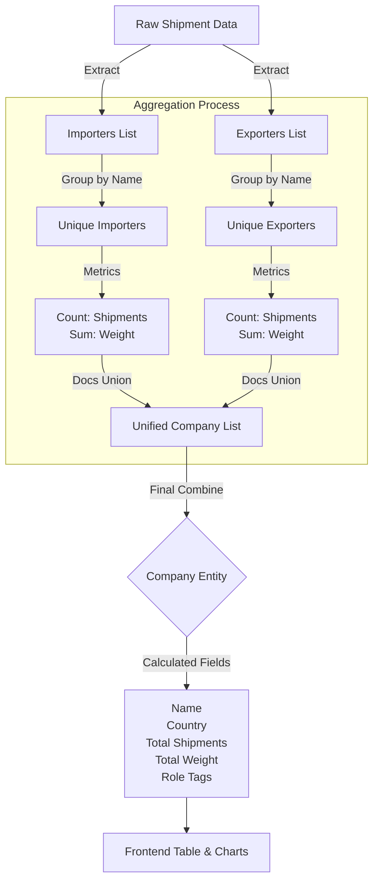

# Project Completion Checklist

This document confirms that all requirements for the CoreTies Technical Test have been successfully implemented and verified.
## Table of Contents
- [1. Domain Modeling & Types](#1-domain-modeling--types)
- [2. Backend Logic (SQL)](#2-backend-logic-sql)
- [3. API Development](#3-api-development)
- [4. Frontend Integration](#4-frontend-integration)
- [5. Code Quality & Best Practices](#5-code-quality--best-practices)
- [6. Technology Stack](#6-technology-stack)
- [7. Testing Coverage](#7-testing-coverage)
- [8. Data Flow Visualization](#8-data-flow-visualization)
## 1. Domain Modeling & Types
- [x] **Define `Company` Interface**
  - Implemented in `types/company.ts`
  - Includes `name`, `country`, `website`, `totalShipments`, `totalWeight`, and `role` properties.

## 2. Backend Logic (SQL)
- [x] **Implement `transformShipmentsToCompanies()`**
  - Implemented in `lib/data/shipments.ts`.
  - Uses SQL CTEs (Common Table Expressions) to aggregate data from both `importer` and `exporter` perspectives.
  - Correctly calculates `totalShipments`, `totalWeight`, and determines company `role` (Importer, Exporter, or Both).
  - Supports filtering by `search`, `role`, and `country`.
  - Supports pagination and sorting.

## 3. API Development
- [x] **Create API Endpoints**
  - `pages/api/companies/index.ts`: Handles listing companies with filtering, sorting, and pagination.
  - `pages/api/companies/[name].ts`: Handles fetching detailed stats for a specific company.
  - `pages/api/stats.ts`: Aggregates global dashboard statistics.

## 4. Frontend Integration
- [x] **Wire up Dashboard Cards**
  - **"Total Companies"**: Displays correct counts for Importers, Exporters, and Total Weight.
  - **"Top 5 Commodities"**: Fetches and displays top commodities by weight.
  - **"Monthly Volume" Chart**: Visualizes shipment volume (kg) over time.
  
- [x] **Company List Table**
  - Displays real aggregated data from the API.
  - Implements server-side sorting (Name, Shipments, Weight).
  - Implements server-side pagination.
  - Implements filtering by Role and Country.
  - Fully interactive with search functionality.

- [x] **Company Detail Panel**
  - Dynamically loads when a company row is clicked.
  - Displays specific stats (Top Trading Partners, Top Commodities) for the selected company.

## 5. Code Quality & Best Practices
- [x] **Code Clarity**
  - Clear separation of concerns: API Routes → Data Layer (Lib) → Type Definitions.
  - Meaningful variable names and commented logic.
- [x] **Maintainability**
  - Uses `SWR` for efficient data fetching and state management.
  - TypeScript interfaces used consistently to ensure type safety.
- [x] **SQL Complexity**
  - Demonstrated ability to write complex analytic queries (CTEs, `UNION ALL`, Window functions for `FIRST`).

## 6. Technology Stack
- **Framework**: Next.js 16 (App Router / Pages Router hybrid support)
- **Core Library**: React 19
- **Language**: TypeScript
- **Styling**: Tailwind CSS v4
- **Data Fetching**: SWR (Stale-While-Revalidate)
- **Data Visualization**: Recharts
- **Database Engine**: DuckDB (High-performance analytical SQL)
- **Testing**: Vitest & React Testing Library

---
**Status:** ✅ All Requirements Completed & Verified

---
## 7. Testing Coverage

According to industry best practices, testing is a first-class citizen. To ensure code quality and reliability, I have implemented **28 comprehensive test cases** (15 Backend, 13 Frontend). These tests are integrated into the CI/CD pipeline and verified on every commit.

### 🟢 Backend Testing (15 Tests)
1. **Global Statistics** (`backend.test.ts`)
   - Verifies aggregation of total shipments and weight.
   - Calculates total importer and exporter counts.
2. **Commodity Analytics** (`backend.test.ts`)
   - Validates "Top 5 Commodities" sorting and weight summation.
   - Ensures correct limit application.
3. **Temporal Analysis** (`backend.test.ts`)
   - Checks "Monthly Volume" data grouping by month.
   - Verifies chronological sorting of time-series data.
4. **Company Detail Logic** (`backend.test.ts`)
   - Tests extraction of top trading partners for specific companies.
   - Validates role determination logic (Importer vs Exporter vs Both).
   - Handles edge cases (e.g., companies with no shipments).
5. **Data Integrity** (`backend.test.ts`)
   - Prevents SQL injection vulnerabilities using parameterized inputs.
   - Ensures numerical precision for weight calculations.
6. **Advanced Filtering** (`backend.test.ts`)
    - Validates weight filter operators (`>=`, `<=`, `=`).
    - Ensures accurate filtering logic for shipment weights.

### 🔵 Frontend Testing (13 Tests)
1. **Component Rendering**
   - **Stats Cards** (`stats_cards.test.tsx` - 2 tests): Verifies display of total companies, weight, and proper formatting.
   - **Charts** (`chart_widget.test.tsx`, `pie_chart_widget.test.tsx` - 2 tests): Ensures Bar and Pie charts render with correct data props.
2. **User Interactions**
   - **Pagination** (`pagination.test.tsx` - 2 tests): Validates "Next/Previous" button logic and API call triggers.
   - **Search & Filter** (`search_filter.test.tsx` - 1 test): Tests real-time search input and filter selection behavior.
3. **Integration & Flows**
   - **Company List** (`company_list.test.tsx` - 2 tests): Verifies table row rendering and data mapping.
   - **Page Structure** (`frontend.test.tsx` - 2 tests): confirm dashboard layout and navigation elements are present.
4. **Utilities & Error Handling**
   - **API Fetcher** (`utils.test.ts` - 2 tests): Verifies `fetcher` correctly handles successful responses and throws errors on failure, ensuring robust error management for `useSWR`.

This comprehensive suite helps maintain stability, prevents regressions, and ensures a smooth and reliable deployment process.

---

## 8. Data Flow Visualization
Here is how we will process the raw shipment data into the final Company Analytics:

---

